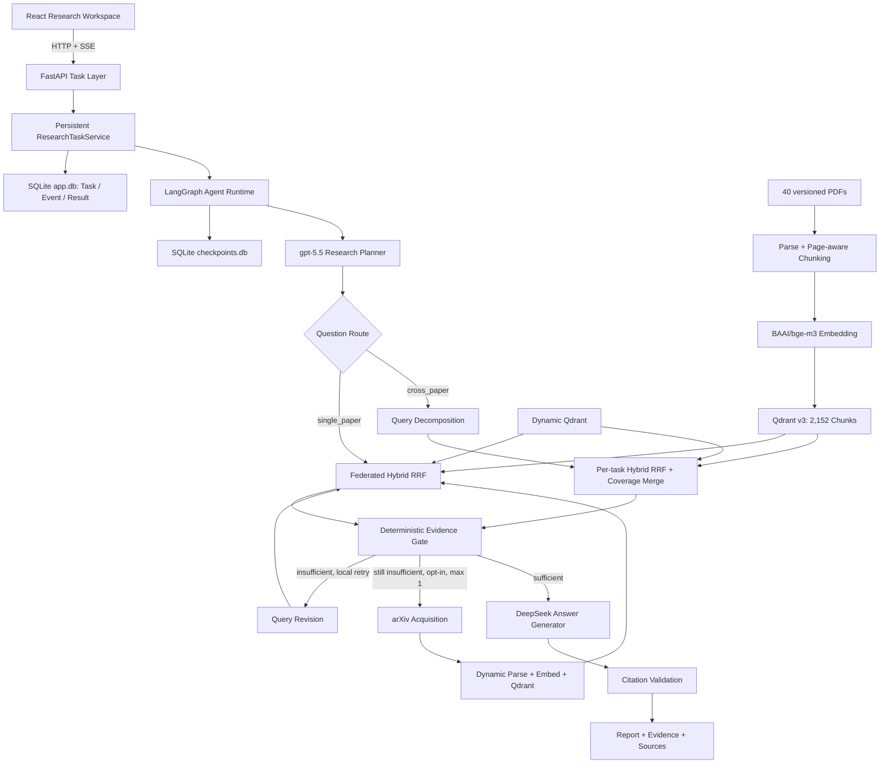

# 系统架构

## 目标

系统将论文研究问题转换为带页码 Citation 的证据约束回答。当前包含两条运行路径：固定 RAG
用于可控 Baseline，LangGraph Agent Runtime 根据问题类型和 Evidence 状态选择检索策略；
FastAPI 任务层将 Runtime 暴露为可查询、可流式观察的异步任务。

React Workspace 通过同源 `/api` 和 `/health` 使用公开契约。它只维护当前 Task 的 UI State、
SSE sequence 和选中结果 Tab，不拥有 Agent 决策状态。

## 总体架构



## API Task Layer

```text
POST /api/v1/research
  -> ResearchTaskService
       SQLite Repository (Task / Event / Result)
       single-worker Executor
  -> ResearchAgentRuntime.run(task_id, event_callback)
  -> LangGraph SQLite Checkpoint (thread_id = task_id)
  -> SSE agent_node events
  -> GET task status / AgentResult

POST /api/v1/research/{task_id}/resume
  -> interrupted -> queued -> running
  -> continue from last committed LangGraph node

POST /api/v1/research/{task_id}/clarify
  -> validate completed Parent AgentResult.clarification
  -> persist Parent / Response / Child relation
  -> run a new Child Task with original question + clarification
```

API 通过回调接收 Runtime 已有的 `AgentEvent`，不读取 LangGraph 私有 State，也不重复实现节点
逻辑。任务服务默认只运行一个 Worker，以保护本地 Qdrant Client 和 JSONL Planner Cache 的写入
边界。FastAPI Route 不直接调用 Provider。

Ambiguous 输入通过独立 Clarification Protocol 继续：父任务先以结构化追问正常结束，用户补充后
创建持久化关联的 Child Task。Child 使用完整的“原问题 + 用户补充”重新进入 Planner、Retrieval
和 Answer；该流程不复用 LangGraph Resume，因为 Resume 只负责恢复被进程中断的同一 Graph
Execution。

## 固定 RAG

```text
Question
  -> 显式 retrieval_mode
  -> Dense 或 Hybrid RRF
  -> AnswerGenerator
  -> Citation Validation
```

固定链路用于低延迟问答和 Evaluation 对照，不包含 Planning、Reflection 或循环。

## Agent Runtime v2

```text
Question
  -> plan_research
       gpt-5.5 结构化分类 + 1-4 个 Research Tasks
  -> retrieve_evidence
       single_paper -> Hybrid RRF
       cross_paper  -> 每个 Task 独立 Hybrid RRF -> Coverage Merge
  -> assess_evidence
       检查 Task 配额和跨论文来源覆盖
  -> sufficient?
       Yes -> write_report
       No  -> revise_queries -> retrieve_evidence（最多一次）
  -> validate_citations
  -> insufficient after revision and acquisition enabled
       -> acquire_evidence (max 1)
       -> retrieve_evidence
       -> assess_evidence
  -> write_report
  -> verify_claims
       检查最多 8 个关键 Claim 与实际引用 Evidence
       必要时在同一次输出中执行一次受控修订
  -> validate_citations
  -> END
```

Question Analyzer 与 Planner 合并成一次结构化调用，避免为了节点数量增加一次模型延迟。
Reflection 不是独立聊天 Agent，而是确定性 Evidence Gate：每个 Task 必须达到 Chunk 配额，
跨论文 Plan 还必须至少覆盖两个不同论文来源。Evidence 不足时先允许 Planner 修改 Query 一次；若
外部扩库显式启用，仍不足时再执行一次 Acquisition 和 Retrieval Retry。此后仍不足则确定性返回
`INSUFFICIENT_EVIDENCE`，不允许 Answer 模型依靠参数知识补全。

LangGraph 只负责编排、State、条件边和停止规则。Retriever、Coverage Merge、AnswerGenerator
与 Citation 契约继续使用项目自己的接口，没有改写成 LangChain Retriever 或 Chain。

## Agent State

`ResearchState` 在节点间传递以下结构化数据：

```text
question
plan / revision
rankings_by_task
evidence
task_candidate_counts / task_selected_counts
assessment
retry_count
acquisition_rounds / acquisition summary
answer
trace
```

`AgentEvent` 为每个节点记录顺序、outcome、latency 和关键 details。Planner 使用输入 SHA-256、
model、Prompt version 和精确输出建立 JSONL 缓存；缓存命中不会重复调用模型。

## 模块边界

| Module | 责任 |
| --- | --- |
| `domain` | 与框架无关的论文、Chunk、Evidence、Citation 与 Answer 模型 |
| `agent` | ResearchPlan、State、LangGraph 节点、条件路由、预算与停止规则 |
| `integrations` | LLM、Embedding、Reranker 和学术数据源适配器 |
| `ingestion` | PDF Parse、Chunk 和版本化 Corpus 导入 |
| `retrieval` | Dense、BM25、RRF、MMR、Rewrite、Reranker 与 Coverage Merge |
| `evaluation` | Dataset、指标、实验执行、缓存与对照报告 |
| `storage` | Repository Protocol、SQLAlchemy/Alembic 业务库与 LangGraph Checkpoint 生命周期 |
| `api` | FastAPI 契约、持久任务生命周期、Clarification、Resume 与 SSE，不承载研究逻辑 |
| `frontend` | React 工作台、SSE 消费、结构化追问与 Report/Evidence/Plan 展示 |

依赖规则：

- `domain` 不依赖 LangGraph、FastAPI、数据库或 Provider SDK。
- `agent` 编排公开服务接口，不实现 Retrieval 算法。
- `retrieval` 不依赖 LangGraph 或 FastAPI。
- `integrations` 将外部响应转换为项目内部模型。
- `evaluation` 调用生产接口，不在评测代码中修改生产行为。
- `api` 只依赖 Agent 的公开 Runtime 与模型，不访问 LangGraph 私有 Graph/State。
- `frontend` 只依赖 HTTP/SSE 契约，不复制 Retrieval、Evidence 或 Citation 规则。

模型路由见 `docs/adr/001-model-routing.md`，Corpus 与存储决策见
`docs/adr/002-retrieval-storage.md`。

v2.0 的 Parser Quality Router Shadow、MinerU Spike、Durable Runtime、Dynamic Ingestion、Federated
Retrieval 与 opt-in Agent Acquisition Loop 均已实现。下一阶段通过 Open-world Evaluation 验收
触发率、答案恢复率和拒答率。实施顺序见 `docs/v2-design.md`，Corpus v3 Baseline 保持冻结。

## Dynamic Ingestion Foundation

```text
search-papers / acquire-papers
  -> arXiv Search + Candidate Rank/Dedup
  -> allowlist Downloader
  -> SQLite Paper Registry / Acquisition Run
  -> Fast Parser Quality Gate
  -> Chunk + Embedding
  -> paper_dynamic_bge_m3_chunking_v1
```

Dynamic Pipeline 不依赖 LangGraph，也不修改 Curated Collection。Agent 的 `acquire_evidence` 节点只
调用该应用服务，不在 Graph 内重新实现 HTTP、SQL 或 Qdrant 写入。Dynamic Point 数变化会让 BM25
generation 懒失效，下一次 Federated Retrieval 即可同时使用新 Dense 和 Lexical Evidence。

## 当前约束

- Planning 使用 Relay `gpt-5.5`，真实首次调用约 10.7 秒；缓存只用于复现，不能掩盖冷启动
  延迟。
- `max_retries` 被 Schema 限制为 0 或 1，不存在开放式自主循环。
- Evidence Gate 是可解释启发式，不等价于语义 Claim-Evidence Verification。
- 当前启用 LangGraph SQLite Checkpointer，但它只提供 node-boundary Resume，不是长期用户 Memory。
- API 使用单机 SQLite 和单 Worker；不支持多 Uvicorn Worker 或水平扩容。
- Agent 动态扩库默认关闭；启用后的触发质量尚未通过 Open-world Evaluation，不宣称已经解决所有
  Corpus 外问题。
- API 仅绑定本机且没有认证，不应直接暴露到公网。
