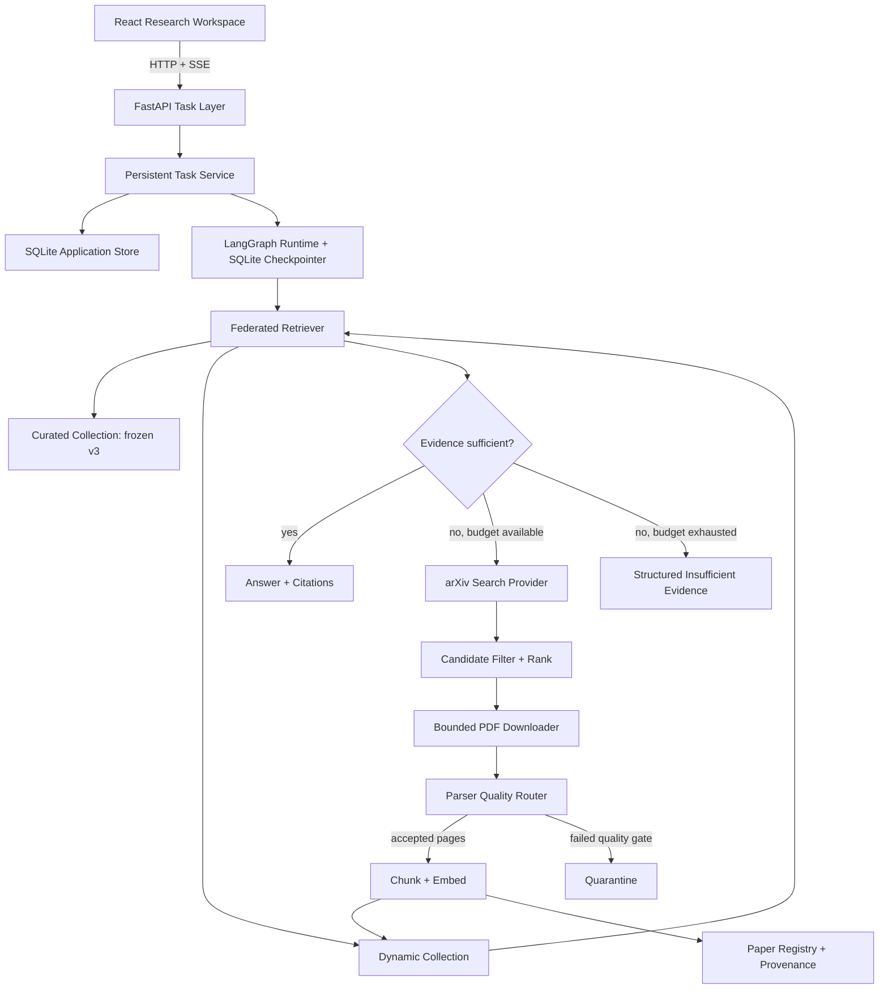

# v2.0 设计基线

## 1. 目标

v2.0 聚焦三个 Epic，不继续扩张 Agent 角色或检索策略：

1. `Parser Quality Router`：识别并隔离乱码、错误阅读顺序和扫描页，避免低质量文本进入索引。
2. `Dynamic Corpus Expansion`：现有证据不足时，受控搜索、下载、解析并索引新论文，然后重新检索。
3. `Durable Research Runtime`：任务、事件、论文资产和 Graph checkpoint 在进程重启后仍可恢复。

v1.0.0 的 Corpus v3、Qdrant Collection 和 Evaluation Baseline 保持不可变。v2 的新能力必须在
独立数据、Collection 和 Evaluation Dataset 上验证，不能通过静默改变 v1 Baseline 获得提升。

### 1.1 Epic 层级

| 层级 | 内容 | v2.0 处理方式 |
| --- | --- | --- |
| 核心实现 | Parser Quality Router | 优先实现 |
| 核心实现 | Dynamic Corpus Expansion | 优先实现 |
| 核心实现 | Durable Research Runtime | 优先实现 |
| 贯穿式验收 | Open-world Evaluation | 随前三项同步建设，属于 Definition of Done |
| 后置增强 | Claim-level Verification | 前三项稳定后进入，不在早期主链路混入 |

`Open-world Evaluation` 不是可选的第四套功能。没有它，就不能证明动态扩库是否正确触发、是否找到了
目标论文、是否真正恢复了答案，也不能发现无效下载和重复写入。

`Claim-level Verification` 也没有被取消。它依赖可靠的页面文本、动态来源 provenance 和持久化运行
记录，因此应在前三个 Epic 通过验收后实施，避免把 Parser 或 Retrieval 故障误判成 Claim-Evidence
故障。

## 2. 非目标

v2.0 不实现以下内容：

- 任意互联网网页爬取，只接入受信任的学术数据源；
- 多 Agent 角色扩张、长期个性化 Memory 或开放式自主循环；
- 多租户、RBAC、Redis/Celery、Kubernetes 或微服务拆分；
- 数学公式到 LaTeX 的完整恢复；
- 在线训练或修改模型权重。动态扩库是知识库扩展，不称为模型“自学习”；
- 重新调优 v1 的 RRF、MMR、Reranker 或 Planner Prompt。

Claim-level Verification 不属于上述永久非目标，而是 v2 核心链路稳定后的后置范围。

## 3. 设计原则

- **Quality before indexing**：未通过 Parse Quality Gate 的页面不得进入 Embedding。
- **Curated remains immutable**：固定 Corpus 与动态 Corpus 分离。
- **Bounded autonomy**：搜索次数、候选数、下载数、文件大小、Chunk 数和重试次数均有上限。
- **Idempotent side effects**：下载、解析、Embedding、Qdrant Upsert 和任务恢复可重复执行。
- **Provenance by default**：每篇论文、每页文本和每个 Chunk 都能追溯来源、版本与处理方式。
- **Persistence outside nodes**：Agent 节点依赖 Repository/Service，不直接执行 SQL。
- **Evaluation before promotion**：新能力通过独立评测后才能进入默认演示链路。

## 4. 目标架构



## 5. Epic A：Parser Quality Router

### 5.1 处理流程

```text
PDF
  -> pypdf 逐页提取
  -> Page Quality Scorer
  -> 质量合格：接受
  -> 质量较低：PyMuPDF 二次提取并择优
  -> 两者仍不合格、扫描页或复杂表格：Structured Parser fallback
  -> 再次评分
  -> accepted / warning / quarantined
```

第一阶段保留 `pypdf` 作为 Primary Parser，增加 `PyMuPDF` 作为 Secondary Parser。两者构成低延迟
Fast Path。扫描页、复杂布局和表格密集论文进入独立的 MinerU Technical Spike；MinerU 通过
`StructuredDocumentParser` 接口隔离，以文档级 Markdown/JSON Block 作为候选结果，不直接耦合现有
Chunker。只有 Benchmark 达到 Go 标准后，MinerU 才成为生产 Structured Fallback。

`RapidOCR` 不与 MinerU 同时首批引入。若 MinerU 的质量、部署或延迟未通过 Spike，再将 RapidOCR
作为更轻量的纯 OCR 备选。Structured Fallback 只对 Gate 判定的异常文档触发，不无条件解析全部
Corpus。

### 5.2 质量特征

`PageQualityScorer` 使用确定性特征，不调用 LLM：

- 非空文本长度与有效字母/数字比例；
- Unicode replacement character、控制字符、Private Use Area 比例；
- 单字符异常重复和不可打印字符比例；
- 单词或中文字符覆盖率；
- 行长度异常、断词和空白密度；
- 与其他 Parser 结果的长度差异。

初始阈值只作为可配置起点：

| Score | 状态 | 行为 |
| ---: | --- | --- |
| `>= 0.75` | accepted | 允许 Chunk 和 Embedding |
| `0.50 - 0.75` | warning | 允许进入候选结果，但保留 warning |
| `< 0.50` | quarantined | 不进入索引 |

阈值必须通过 Parse Benchmark 校准，不能只凭单篇论文观察调整。

### 5.3 领域模型

```text
PageParseResult
  page_number
  text
  parser_name
  quality_score
  quality_status
  ocr_used
  warnings

DocumentParseResult
  metadata
  pages
  parser_version
  accepted_pages
  warning_pages
  quarantined_pages
  document_status
```

`ParsedPage` 将增加带默认值的 Parse provenance，保持现有 Chunker 调用方式兼容。Chunk 需要记录
`parser_name`、`parser_version`、`parse_quality_score` 和 `ocr_used`，从 Citation 可以回溯到页面
处理过程。

### 5.4 冻结语料策略

- Corpus v3 不重新向量化，继续作为 v1 Evaluation Baseline。
- Parser Router 先对 v3 执行 shadow parse，只生成对照报告，不写入原 Collection。
- 如果新 Parser 确有收益，后续创建 Corpus v4 或新的 Parse/Chunking 版本与 Collection。
- Dynamic Corpus 从第一天使用 Parser Router，低质量页面不能进入动态 Collection。

### 5.5 MinerU Technical Spike

Spike 使用独立 Adapter 和输出目录，不修改生产 Parser。样本至少覆盖普通文本、双栏、公式密集、
原生表格、扫描表格和混合扫描 PDF。除正文完整度外，必须通过 Table QA 验证表头、行列和数值对应
关系，不能把“识别出了字符”当作表格解析成功。

Go 标准：

- 已知扫描/复杂布局问题页的可用文本恢复率高于 Fast Path；
- Table QA Accuracy 相比 Fast Path 有实质提升；
- page number 与 block bounding box provenance 完整；
- 普通文本 PDF 不因路由到 MinerU 产生主链路回退；
- 单篇耗时、模型大小和运行环境能在 Demo 机器上接受；
- 当前 MinerU 代码与模型 License 经核对适合公开作品仓库和演示方式。

若通过，后续领域模型增加 `ContentBlock`：`title/paragraph/table/formula/figure/caption`，表格保留
Markdown/HTML、caption、page number 和 bbox；Chunking 对小表格整体保留，对大表格切分时重复表头。
若不通过，Fast Path 保持生产默认，并验证 RapidOCR 作为扫描页轻量 fallback。

## 6. Epic B：Dynamic Corpus Expansion

### 6.1 触发条件

动态扩库只在以下条件全部成立时触发：

1. 当前 `EvidenceAssessment` 为 insufficient；
2. 至少一个 Research Task 未达到证据配额或来源覆盖要求；
3. 当前任务允许 external acquisition；
4. 搜索、下载、Embedding 和总耗时预算尚未耗尽；
5. 本轮尚未执行过相同 Query 的 Acquisition。

现有一次 Query Revision 保留，但执行顺序调整为：先尝试本地 Query Revision，再触发一次受控扩库；
扩库后只允许一次 Retrieval Retry，避免开放式循环。

### 6.2 学术搜索接口

```python
class AcademicSearchProvider(Protocol):
    def search(self, query: str, limit: int) -> tuple[PaperCandidate, ...]: ...

class PaperDownloader(Protocol):
    def download(self, candidate: PaperCandidate) -> DownloadedPaper: ...
```

v2.0 首个 Provider 只实现 arXiv。OpenAlex、Semantic Scholar 和 Crossref 保留为后续适配器，不能
在第一版同时接入多个来源并增加去重复杂度。

### 6.3 候选与资产状态

```text
PaperCandidate
  provider / external_id / revision
  title / authors / abstract / published_at
  landing_url / pdf_url

PaperAsset
  asset_id / sha256 / local_path
  source metadata
  acquisition_query / acquired_at
  parse status / index status

Lifecycle
  discovered
    -> selected
    -> downloaded
    -> parsed
    -> indexed
    -> active

Failure
  download_failed / quarantined / indexing_failed
```

### 6.4 安全与成本边界

默认预算：

| 项目 | 默认上限 |
| --- | ---: |
| Search queries | 2 |
| Candidates per query | 5 |
| Downloads per research task | 2 |
| PDF size | 50 MiB |
| Redirects | 3 |
| Download timeout | 60 s |
| Dynamic chunks per task | 500 |
| Acquisition rounds | 1 |

下载策略还必须校验：

- 域名 allowlist，只接受 arXiv 官方 landing/PDF URL；
- HTTPS、Content-Type、`%PDF` 文件头和最终响应大小；
- arXiv ID/revision、SHA-256 和文件大小；
- DOI/arXiv ID/SHA-256 三层去重；
- 文件路径由规范化 ID 和 SHA-256 生成，不使用远端文件名；
- 解析失败进入 quarantine，不执行 Embedding；
- UI 与 Trace 显示本次新增论文和失败原因。

### 6.5 Collection 与 Retrieval

```text
Curated
  agent_seed_v3_bge_m3_chunking_v1
  immutable

Dynamic
  paper_dynamic_bge_m3_chunking_v1
  mutable through idempotent ingestion
```

`FederatedRetriever` 分别检索 Curated 与 Dynamic Collection，再通过确定性 RRF 合并。当前
`Bm25Retriever` 是内存索引，因此动态论文成功写入后必须使 Dynamic Retriever generation 失效并
重建 BM25；不能出现 Dense 已看到新论文而 BM25 仍使用旧快照的状态。

动态论文不会加入 Corpus v3 Manifest，也不会影响 v1/v3 Baseline。只有经过人工审核的资产才能在
未来晋升为新的 Curated Corpus 版本。

## 7. Epic C：Durable Research Runtime

### 7.1 存储边界

v2.0 使用 SQLite，适配单机作品演示和单 Worker 约束：

```text
data/app.db
  SQLAlchemy 2 + Alembic
  Research Task / Event / Result
  Paper Registry / Acquisition Run

data/checkpoints.db
  langgraph-checkpoint-sqlite
  LangGraph state checkpoints

Qdrant
  Chunk payload + dense vectors
```

业务表与 LangGraph checkpoint 分库，避免应用迁移脚本依赖 LangGraph 内部 Schema，也降低长事务导致
的锁竞争。`TaskRepository`、`EventRepository`、`PaperAssetRepository` 和
`AcquisitionRepository` 以 Protocol 暴露，API 与 Agent 不依赖 SQLAlchemy Model。

### 7.2 核心表

```text
research_tasks
  task_id, question, status, created_at, started_at, completed_at
  current_node, attempt, result_json, error_code, error_message

research_events
  task_id, sequence, event_type, status, payload_json, created_at
  UNIQUE(task_id, sequence)

paper_assets
  asset_id, provider, external_id, revision, sha256
  title, authors_json, source_url, local_path
  lifecycle_status, parse_summary_json, index_version, timestamps
  UNIQUE(provider, external_id, revision)
  UNIQUE(sha256)

acquisition_runs
  acquisition_id, task_id, query, status, budget_json
  candidate_count, selected_count, downloaded_count, indexed_count
  started_at, completed_at, error_code
```

### 7.3 恢复语义

- `queued/succeeded/failed` 任务在重启后保持原状态。
- 进程退出时仍为 `running` 的任务在启动恢复阶段改为 `interrupted`，不会被误报为 running。
- `POST /api/v1/research/{task_id}/resume` 从最近 checkpoint 恢复；没有有效 checkpoint 时明确失败。
- `thread_id` 固定等于 `task_id`，不能用随机 Graph thread 绕过历史状态。
- SSE `sequence` 来自数据库事务，重启后仍严格递增，`after=N` 继续有效。
- 下载、Qdrant 写入等外部副作用在执行前检查 idempotency key，恢复时不会重复增加资产或点数。
- v2.0 不承诺任意 Python 指令级恢复，只保证已提交的 LangGraph node 边界恢复。

### 7.4 API 契约增量

现有接口保持兼容，增加：

```text
ResearchTaskStatus += interrupted
POST /api/v1/research/{task_id}/resume
GET  /api/v1/research/{task_id}/acquisitions
GET  /api/v1/papers/{asset_id}
```

`GET /health` 将报告 `task_store=sqlite`、checkpoint readiness、Dynamic Collection 和 Paper
Registry 状态。数据库异常不得被伪装为 Runtime Ready。

## 8. 模块边界

```text
domain/
  parse.py              Parse quality/provenance models
  acquisition.py        Candidate, asset and budget models

ingestion/
  extractors.py         pypdf / PyMuPDF adapters
  quality.py            deterministic quality scorer
  router.py             page-level selection and quarantine
  structured/
    base.py             StructuredDocumentParser protocol
    mineru.py           isolated MinerU spike adapter
  dynamic.py            parse -> chunk -> embed -> Qdrant orchestration

integrations/scholarly/
  base.py               AcademicSearchProvider protocol
  arxiv.py              arXiv API adapter
  downloader.py         bounded trusted PDF downloader

storage/
  models.py             SQLAlchemy persistence models
  repositories.py       application-facing protocols
  sqlite.py             SQLite implementations
  migrations/           Alembic migrations

retrieval/
  federated.py          curated + dynamic RRF

agent/
  acquisition.py        bounded acquisition nodes and routing

api/
  service.py            persistent task lifecycle
```

依赖规则：

- `domain` 不依赖 Parser、SQLAlchemy、Qdrant、LangGraph 或 FastAPI。
- Parser Router 不写数据库和 Qdrant，只返回结构化 Parse Result。
- Dynamic Ingestion Service 负责副作用编排，但通过 Repository 和 Vector Store 接口执行。
- Search Provider 不决定哪些论文进入索引；Candidate Selection 属于应用服务。
- Agent 节点只调用 Search/Acquisition/Retrieval 服务，不拼接 URL、不执行 SQL。
- API 读取持久化任务快照，不读取 LangGraph 私有 checkpoint Schema。

## 9. Evaluation 与验收标准

### 9.1 Parse Benchmark v1

至少包含：正常文本 PDF、字体映射乱码、双栏阅读顺序异常、公式密集页、纯图片页和混合扫描页。

| 指标 | v2.0 验收目标 |
| --- | ---: |
| Corpus v3 shadow parse 可打开率 | 100% |
| 已知问题页乱码检出率 | >= 90% |
| 可恢复问题页修复率 | >= 80% |
| 低于 quarantine 阈值页面进入索引 | 0 |
| Page parse provenance 完整率 | 100% |

### 9.2 Open-world Evaluation v1

首版 15 条：5 条 In-corpus、5 条 Out-of-corpus Recoverable、5 条 Unrecoverable/Ambiguous。

| 指标 | v2.0 验收目标 |
| --- | ---: |
| In-corpus unnecessary acquisition rate | <= 10% |
| Recoverable target paper Recall@5 | >= 80% |
| Dynamic ingestion success rate | >= 80% |
| Out-of-corpus answer recovery rate | >= 60% |
| Unrecoverable 正确拒答率 | >= 80% |
| 重复执行后的重复资产/Point | 0 |
| Citation provenance accuracy | 100% |

### 9.3 Persistence Integration v1

- 已完成 Task、Event 和 Result 重启后 100% 可查询；
- 人为中断 running Task 后状态变为 `interrupted`；
- Resume 从 node checkpoint 继续，事件 sequence 不回退；
- 同一个 Acquisition 恢复执行不重复下载、Embedding 或增加 Qdrant Point；
- Repository contract tests 同时覆盖内存 Fake 与 SQLite 实现；
- 现有 v1 Python/Frontend 测试保持通过。

## 10. 实施阶段

### Phase 0：冻结 Baseline 与建立问题样本

模块：`evaluation`、`scripts`、`tests/fixtures`。

- 从现有 Corpus 和用户遇到的 PDF 中建立 Parse Benchmark Manifest。
- 标注正常页、乱码页、空文本页、双栏页、公式页、原生表格和扫描表格。
- 保存 v1 `pypdf` 输出、耗时和问题分类，形成不可变 Baseline。

完成条件：Dataset 可重复加载，PDF SHA-256 与目标页固定，Baseline Report 可由一个命令生成。

### Phase 1：Fast Parser Quality Router

模块：`domain`、`ingestion`、`cli`、`tests/unit`、`evaluation`。

- 定义 Page Parse provenance 和 Quality Result。
- 抽离 `PypdfExtractor`，增加 `PyMuPdfExtractor`。
- 实现确定性 `PageQualityScorer` 和逐页择优 Router。
- 增加 `inspect-parse-quality` 与 shadow parse report。
- 对 Corpus v3 只执行 shadow mode，不写 Qdrant。

完成条件：现有 Parser/Chunker 测试不回退；问题页检出率达到门槛；quarantined 页面无法进入
Chunking；每页选择原因可观察。

### Phase 2：MinerU Structured Parser Spike

模块：`ingestion/structured`、`evaluation`、`scripts`，必要时增加独立运行环境或容器配置。

- 实现隔离的 `MineruAdapter`，保留 Markdown/JSON Block、page number 和 bbox。
- 运行普通文本、扫描页、复杂布局和表格 QA 对照。
- 报告解析质量、Table QA、P50/P95、CPU/GPU 与模型体积。
- 根据 Go/No-Go 决定接入 Structured Fallback，或改为 RapidOCR 轻量 fallback。

完成条件：形成明确决策和 ADR 更新。未通过前不得修改生产 Parser 默认路径。

### Phase 3：Persistent Store Foundation

模块：`storage`、`api`、`agent`、`tests/integration`。

- 建立 SQLAlchemy Model、Alembic Migration 和 Repository Protocol。
- 持久化 Task、Event、Result、Paper Asset 和 Acquisition Run。
- 替换进程内 Task/Event Store，保持现有 HTTP/SSE 契约兼容。
- 接入独立 LangGraph SQLite Checkpointer，增加 interrupted 与 Resume 语义。

完成条件：重启后 Task/Event/Result 可查询；SSE sequence 可续读；node-boundary Resume 不重复事件。

### Phase 4：Academic Search 与 Dynamic Ingestion

模块：`integrations/scholarly`、`ingestion/dynamic`、`storage`、`retrieval`、`evaluation`。

- 先实现 arXiv Metadata Search、Candidate Model、排序和去重，不立即下载。
- 再加入 allowlist Downloader、PDF 校验、Paper Registry 和幂等本地资产存储。
- 通过 Parser Quality Router 后执行 Chunk、Embedding 和 Dynamic Qdrant Upsert。
- 成功写入后重建 Dynamic BM25 snapshot。

完成条件：同一 revision 重复摄取不重复下载、不重复 Embedding、不增加 Qdrant Point；失败资产进入
quarantine；动态 Collection 与 Corpus v3 完全分离。

### Phase 5：Federated Retrieval 与 Agent Acquisition Loop

模块：`retrieval/federated`、`agent`、`api`、`frontend`。

- Curated 与 Dynamic 各自检索并通过 RRF 融合。
- Evidence insufficient 时按预算触发一次 Search/Acquire/Retry。
- Trace 和 UI 显示候选、下载、Parse、Index 与重新检索状态。
- 任务恢复使用相同 Acquisition idempotency key。

完成条件：Agent 有明确停止条件；In-corpus 问题不会普遍触发下载；扩库后的 Citation 能追溯到动态
论文、页码和 Parser provenance。

### Phase 6：Open-world Evaluation 与 v2 验收

模块：`evaluation`、`evals`、`docs`，必要时补充 `frontend` 可观测性。

- 固定 In-corpus、Recoverable、Unrecoverable/Ambiguous 三组 Dataset。
- 报告 Acquisition Trigger、Paper Recall、Recovery Rate、拒答率、幂等、Citation、延迟和成本。
- 运行重启恢复与失败注入测试。
- 只有达到第 9 节指标后才把 v2 链路设为默认 Demo。

完成条件：生成可复现实验报告，并明确保留失败边界。Claim-level Verification 在此后作为后置增强
进入下一阶段，不阻塞前三个核心 Epic 的 v2 验收。

## 11. 模块责任矩阵

| Module | v2.0 新责任 | 不承担的责任 |
| --- | --- | --- |
| `domain` | Parse provenance、Candidate、Asset、Budget 模型 | Parser SDK、SQL、HTTP |
| `ingestion` | Fast/Structured Parser、Quality Gate、动态摄取编排 | Agent 路由、API |
| `integrations/scholarly` | arXiv Search 与受控下载适配 | 候选决策、Embedding |
| `storage` | Task/Event/Asset/Acquisition Repository | LangGraph 节点逻辑 |
| `retrieval` | Curated/Dynamic Federated Retrieval、BM25 generation | 下载与持久化 |
| `agent` | Evidence 缺口路由、受控 Acquisition Loop、停止规则 | Parser 与 SQL 实现 |
| `api` | 持久任务、Resume、SSE 与公开状态 | Retrieval/Acquisition 算法 |
| `evaluation` | Parse、Open-world、Persistence 指标和 Harness | 修改生产行为 |
| `frontend` | Acquisition/Resume 可观察性 | 保存 Agent 私有 State |

执行上严格按 Phase 顺序推进，每个 Phase 单独提交、测试和记录开发过程。当前第一个编码任务是
Phase 0：建立 Parse Benchmark Manifest 和 v1 Baseline Runner；完成后再进入 Phase 1 的双 Parser。
